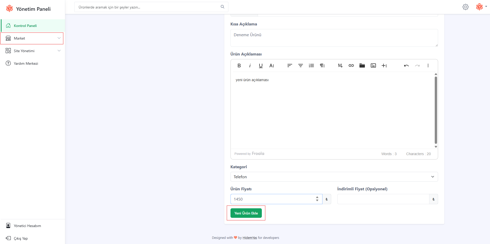
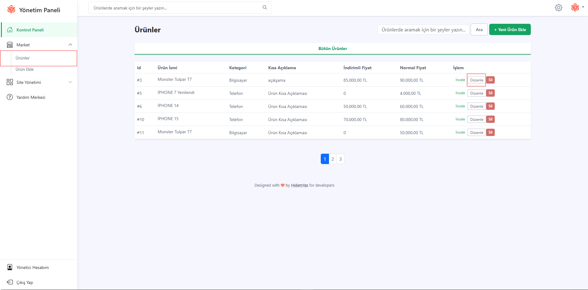
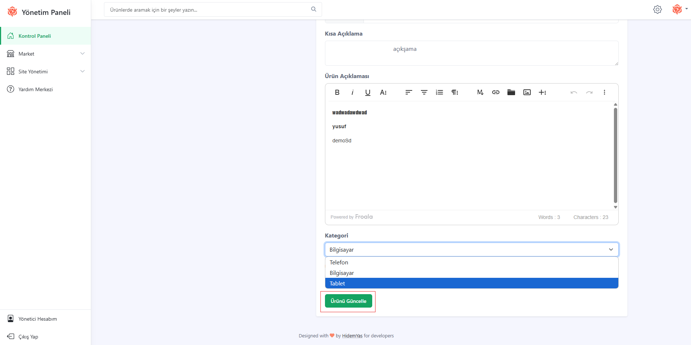
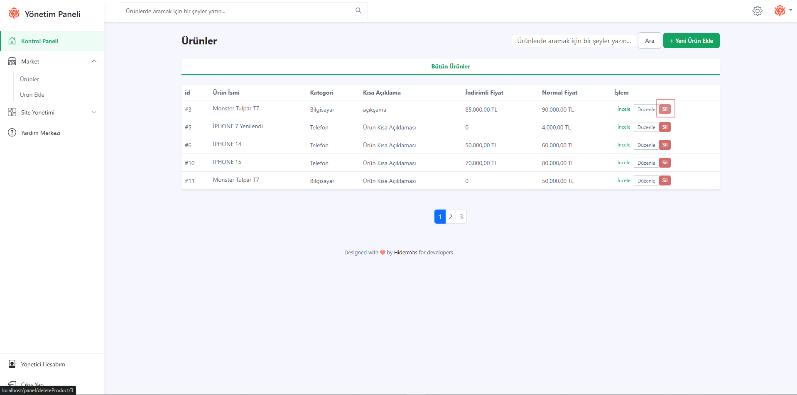

### 📦 Product Management

You can perform operations related to products from the admin panel:

## ➕ Add Product

- Click on the market section in the left menu.
- Click on the "Add Product" button.
- Enter the product information (title, description, price, category).
- Add the product by clicking the "Add New Product" button.

---

## ✏️ Edit Product
- Click on the market section in the left menu.
- Click on the "Products" button.
- Select the product you want to edit from the list.
- Click on the "Edit" icon.
  
- After making the necessary updates, click on "Update Product".
  
---

## ❌ Product Deletion
- Click the market section on the left menu.
- Click the "Products" button.
- Click the "Delete" button next to the product you want to delete in the product list.
  
- Confirm the operation when the confirmation window opens.
- The product is deleted from the system.
  
> ⚠️ Deleted products cannot be brought back!