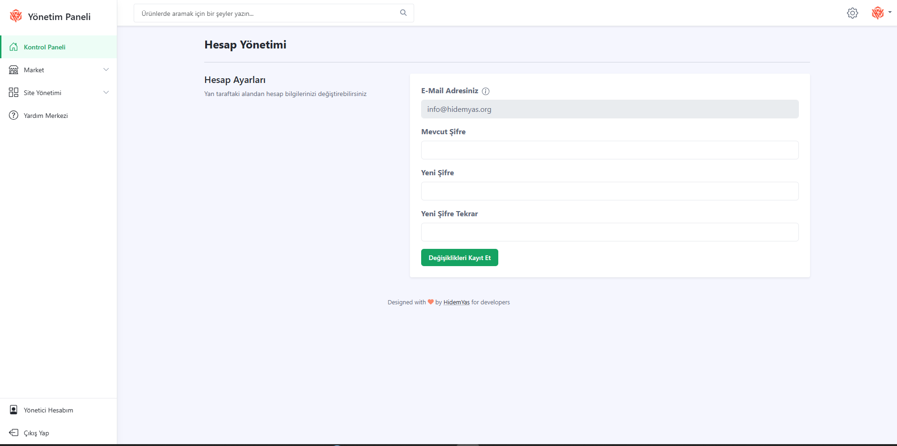

# 👤 Admin Bilgilerini Değiştirme

Admin panelde "Kullanıcı Ayarları" kısmından şifre değiştirilebilir.

### Şifre Güncelleme:
- Mevcut şifre girilir
- Yeni şifre girilir ve tekrar onaylanır
- "Kaydet" butonu ile işlem tamamlanır

  
> Güvenlik için güçlü bir şifre tercih edilmesi önerilir.
