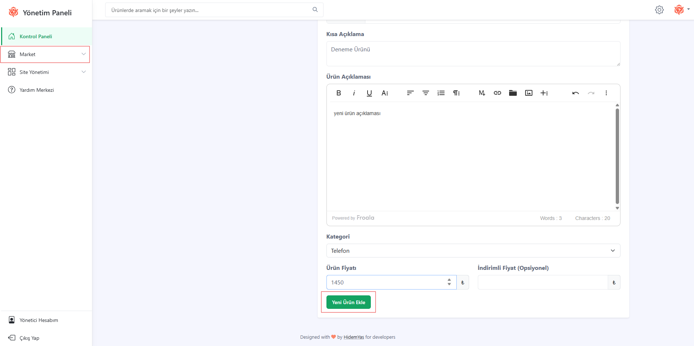
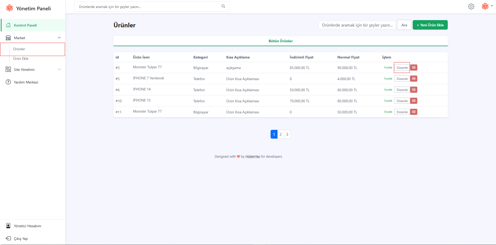
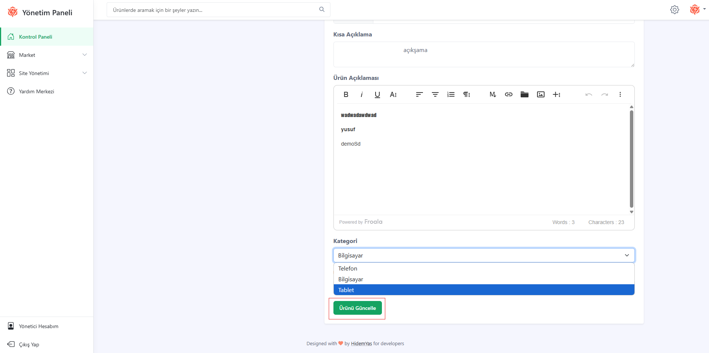
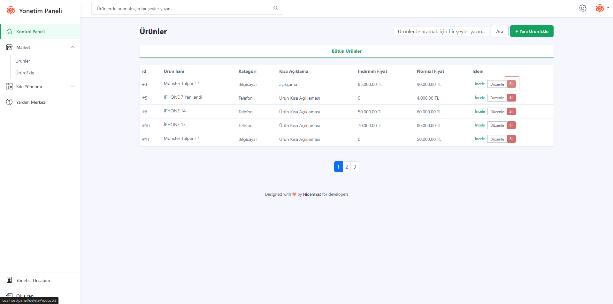
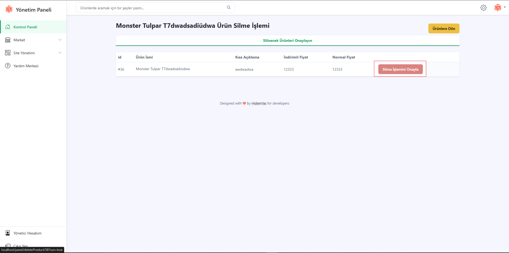

### 📦 Ürün Yönetimi

Admin panelinden ürünlerle ilgili işlemleri gerçekleştirebilirsiniz:

## ➕ Ürün Ekleme

- Sol menüde market kısmına basın.
- "Ürün Ekle" butonuna tıklayın.
- Ürün bilgilerini (başlık, açıklama, fiyat, kategori) girin.
- "Yeni Ürün Ekle" butonuna basarak ürünü ekleyin.

---

## ✏️ Ürün Düzenleme
- Sol menüde market kısmına basın.
- "Ürünler" butonuna tıklayın.
- Liste içerisinden düzenlemek istediğiniz ürünü seçin.
- "Düzenle" ikonuna tıklayın.

- Gerekli güncellemeleri yaptıktan sonra "Ürünü Güncelle"ye basın.

---

## ❌ Urun Silme
- Sol menüde market kısmına basın.
- "Ürünler" butonuna tıklayın.
- Ürün listesinde silmek istediğiniz ürünün yanındaki "Sil" butonuna tıklayın.
  
- Onay penceresi açıldığında işlemi onaylayın.
- Ürün sistemden silinir.
  
> ⚠️ Silinen ürünler geri getirilemez!
